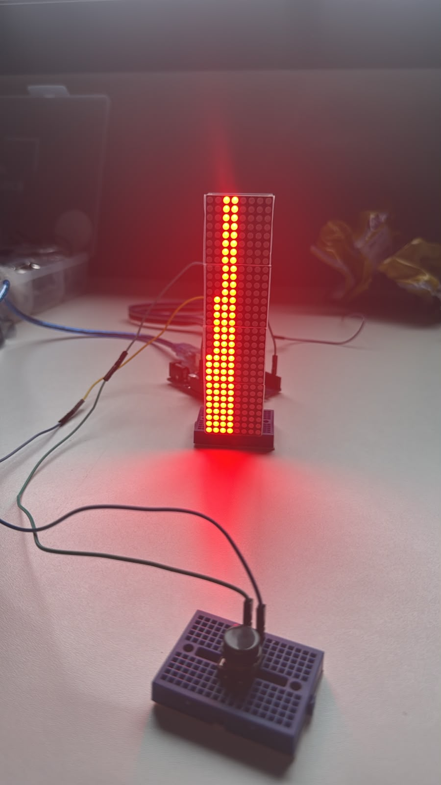
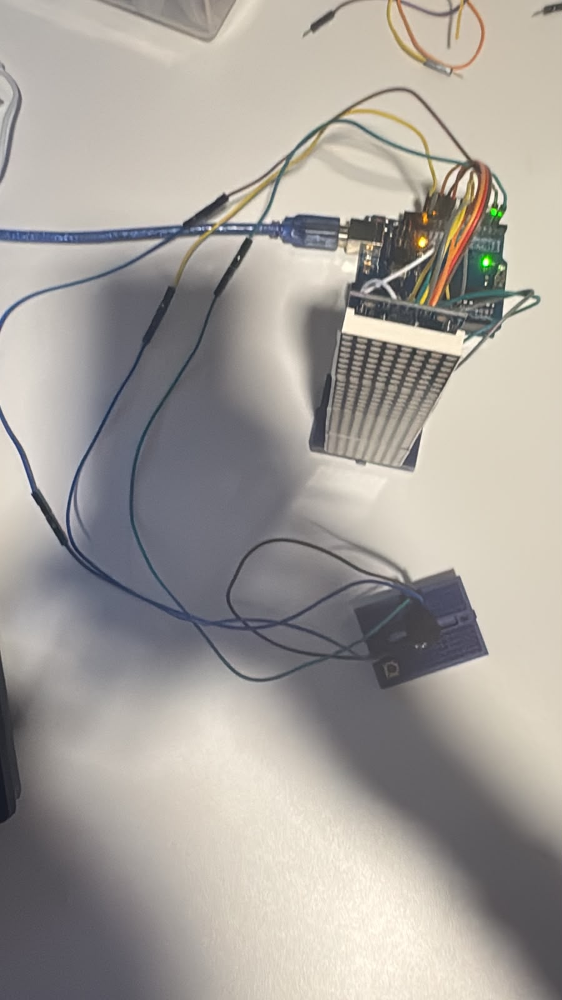
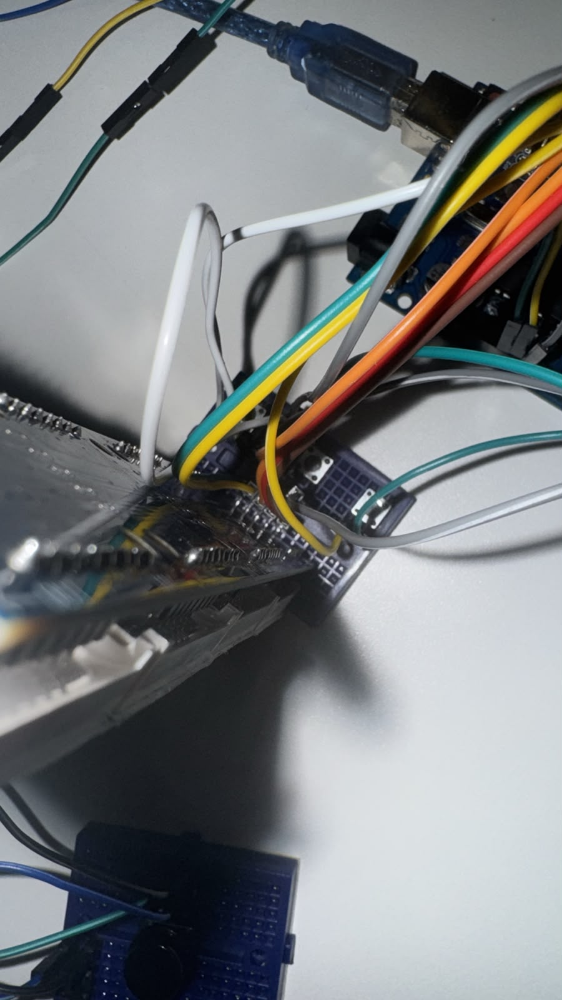
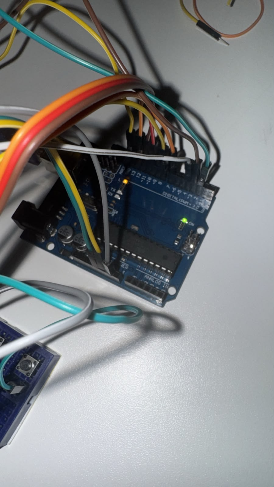

# Stack de blocos

Trabalho da disciplina SSC0180 Eletrônica para Computação.

Jogo eletrônico do tipo empilhador de blocos (semelhante ao Stack), implementado em uma matriz de LEDs controlada por Arduino. O jogador encaixa blocos móveis uns sobre os outros; cada erro reduz o tamanho do próximo bloco.

## Integrantes

| Aluno                    | Nº USP   |
| ------------------------ | -------- |
| Arthur Amorim Ruschel    | 17024102 |
| Gabriel Perlati Souza    | 17071123 |
| Gabriel Meirelles Cury   | 17071102 |
| Pedro Bariquelo Buratini | 16895930 |

## Sobre o projeto

O circuito usa um **Arduino Uno R3** e **quatro módulos de matriz LED 8×8**, conectados em cascata via SPI, formando um display vertical de **8 colunas × 32 linhas**.

A interface do jogador tem **cinco botões táteis** de 6×6 mm, ligados com pull-up interno do Arduino:

| Função           | Pino |
| ---------------- | ---- |
| Soltar bloco     | D2   |
| Reset geral      | D3   |
| Velocidade alta  | D4   |
| Velocidade média | D7   |
| Velocidade baixa | D8   |

## Componentes utilizados

| Componente          | Especificação                | Qtd usada | Valor         |
| ------------------- | ---------------------------- | --------- | ------------- |
| Placa Arduino       | Uno R3 (clone)               | 1         | R$ 39,90      |
| Módulo matriz LED   | 4× MAX7219 (FC16) em cascata | 1         | R$ 22,00      |
| Botão tátil         | 6×6 mm                       | 5         | R$ 2,75       |
| Protoboard          | BB-01 400P                   | 1         | R$ 21,70      |
| Jumpers macho-macho | vários                       | 1 pacote  | R$ 20,00      |
| Cabo USB            | A para B                     | 1         | R$ 12,00      |
| **Total**           |                              |           | **R$ 118,35** |

## Circuito no Tinkercad

<!--inserir link do tinkercad aqui-->

### Ligações

**Matriz MAX7219 → Arduino**

| Pino do módulo | Arduino |
| -------------- | ------- |
| VCC            | 5 V     |
| GND            | GND     |
| DIN            | D12     |
| CLK            | D11     |
| CS (LOAD)      | D10     |

**Botões → Arduino**

| Botão            | Pino |
| ---------------- | ---- |
| Soltar bloco     | D2   |
| Reset            | D3   |
| Velocidade alta  | D4   |
| Velocidade média | D7   |
| Velocidade baixa | D8   |

## Funcionamento do jogo

- Um bloco de 4 LEDs de largura se move horizontalmente na base do display, ricocheteando entre as bordas.
- O jogador pressiona o botão principal para soltar o bloco na posição atual.
- O sistema verifica quantos LEDs se alinharam com a camada já empilhada embaixo.
- Se nenhum LED alinhar, ocorre game over.
- Se algum alinhar, a torre cresce, mas o próximo bloco nasce com largura reduzida.
- A cada bloco encaixado, o intervalo entre movimentos diminui (aceleração).
- Se a pilha atingir o topo (32 linhas), o jogo termina.

### Sistema de dificuldade

Os três botões de velocidade ajustam simultaneamente o delay inicial, a aceleração por bloco e o delay mínimo:

| Dificuldade | Delay inicial | Aceleração por bloco | Delay mínimo |
| ----------- | ------------- | -------------------- | ------------ |
| Baixa       | 260 ms        | 5 ms                 | 90 ms        |
| Média       | 200 ms        | 10 ms                | 50 ms        |
| Alta        | 160 ms        | 18 ms                | 25 ms        |

### Game over

Quando o jogo termina, o display pisca e depois permanece apagado, aguardando o botão de reset.

## Cálculos e escolha dos periféricos

### Pull-up interno nos botões

Em vez de resistores externos de pull-up (tipicamente 10 kΩ entre o pino e 5 V), usamos `pinMode(pino, INPUT_PULLUP)`. O Arduino já possui resistores internos (~20–50 kΩ para 5 V), o que simplifica a fiação: cada botão liga o pino diretamente ao GND. Ao pressionar, o pino lê nível LOW; solto, o pull-up mantém HIGH.

### Debounce de 50 ms

Botões mecânicos “chacoalham” ao fechar o contato, gerando leituras falsas. O código usa `DEBOUNCE_MS = 50`, valor típico para chaves táteis de 6 mm (o bounce costuma durar de 5 ms a 50 ms). A leitura usa `millis()` em vez de `delay()`, para o botão de reset responder a qualquer momento.

### Parâmetros de velocidade

Os delays inicial, mínimo e a aceleração foram ajustados **empiricamente** em testes na matriz real, buscando partidas jogáveis nas três dificuldades. A fórmula `moveDelay = max(minDelay, moveDelay - aceleração)` garante que o jogo acelere progressivamente sem ficar impossível.

### Alimentação

O Arduino é alimentado por **USB 5 V**. O módulo MAX7219 opera em 5 V e consome corrente proporcional ao número de LEDs acesos; para este jogo, a alimentação USB do Uno é suficiente com quatro módulos em cascata.

### Pinos SPI

D10 (CS), D11 (CLK) e D12 (MOSI/DIN) são os pinos usados para comunicação com a matriz.

## Software

- **Sketch:** `[stackdeblocos/stackdeblocos.ino](stackdeblocos/stackdeblocos.ino)`
- **IDE:** [Arduino IDE](https://www.arduino.cc/en/software) 1.8.x ou 2.x
- **Biblioteca:** MD_MAX72xx (instalar pelo Gerenciador de Bibliotecas)

## Funcionamento e montagem

## Demonstração em vídeo

https://github.com/user-attachments/assets/a6c5c8f4-6e85-4939-aee6-9c1004b5b935